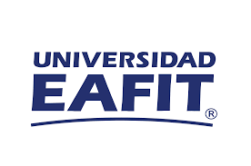

<!-- PROJECT LOGO -->
 

  

  <h3 align="center">Informe de actividades</h3>

  

    Informe de actividades realizadas en el primer año de vinculación a la Escuela de Ciencias Aplicadas e Ingeniería de la Universidad EAFIT   
    Juan David Martínez Vargas
  

<!-- TABLE OF CONTENTS -->

  
Tabla de contenidos

  <ol>
    <li><a href="#Introducción">Introducción</a></li>
    <li><a href="#Docencia">Docencia</a></li>
    <li><a href="#Investigacion">Investigación</a></li>
    <li><a href="#Servicio">Servicio</a></li>
    <li><a href="#Resumen">Resumen de actividades</a></li>
  </ol>

## **Docencia**

### Docencia directa

En pregrado orienté los siguientes cursos:

| Curso                       |     Código      |    Período            | Evaluación     |
| :----------------:          |     :---:       |     :------:          | ----:          |
| Electrónica digital         |      ST0248     |    2022-2   2023-1 | 4.51   4.64 |
| Proyecto integrador         |      ST0251     |    2022-2   2023-1 | 4.42   4.58 |
| Pensamiento computacional   |      ST0367     |    2022-2   2023-1 | 4.79   4.65 |

En posgrado orienté el siguiente curso

| Curso                             |     Código      |    Período            | Evaluación     |
| :----------------:                |     :---:       |     :------:          | ----:          |
|  Aprendizaje de máquina aplicado  |      ST1613     |    2022-2   2023-1 | 4.43   4.95 |

### Docencia indirecta

Actualmente, dirijo o co-dirijo los siguientes trabajos de grado de la Maestría en Ciencias de los Datos y Analítica:

Título: Aplicación de técnicas de clusterización para la clasificación de música Dance Electrónica  
Estudiante: Carlos Alberto Murillo Martínez  
Co-director: Marco Alunno
Estado: Enviada para evaluación

Título: Reconocimiento de emociones a partir del habla (SER)  
Estudiante: Jeison Erley Giraldo Toro  
Director: Edwin Nelson Montoya Munera
Estado: A enviar para evaluación

Título: Hurto a personas en la ciudad de Medellín: Análisis predictivo de la cantidad de casos en diferentes zonas de la ciudad a partir de modelos de machine learning implementando técnicas de MLOps  
Estudiante: Jeferson Stiven Arboleda Colorado  
Estado: A enviar para evaluación

Título: Índice de riesgo de malnutrición en niños de 0 a 5 años basado en factores sociales y demográficos en la ciudad de Medellín
Estudiante: Santiago Bedoya Ríos
Co-directora: Lina María Sepúlveda Cano
Estado: A enviar para evaluación

Título: Identificación de anomalías en el aislamiento de líneas de transmisión a partir de imágenes
Estudiante: Daniel Alonso Sánchez Echeverri
Co-director: Édison Valencia Díaz
Estado: En proceso

## **Investigación**

### Artículos 

En el primer año de vinculación, participé en la escritura de los siguientes artículos. 

Rivera-Muñoz, L. M., Giraldo-Forero, A. F., & Martinez-Vargas, J. D. (2022). Deep matrix factorization models for estimation of missing data in a low-cost sensor network to measure air quality. Ecological Informatics, 71, 101775.   
Estado: Publicado  
doi: [https://doi.org/10.1016/j.ecoinf.2022.101775](https://doi.org/10.1016/j.ecoinf.2022.101775)  
SJR: Q1

### Proyectos

### Estudiantes

### Semilleros

